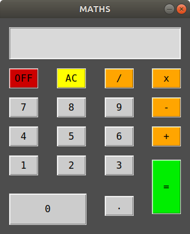

# A Slick Calculator for Maths

An awesome calculator developed with Tkinter.

By: Wali Morris

After studying Python and working with Tkinter I wanted to put this newly learned, and limited, knowledge
to the test. It's important to practice and although this calculator may not win over many, I'm still 
happy to have struggled through this process early to learn alot. 

So, here's another go with a calculator developed using Tkinter! 

